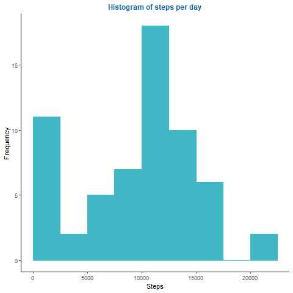
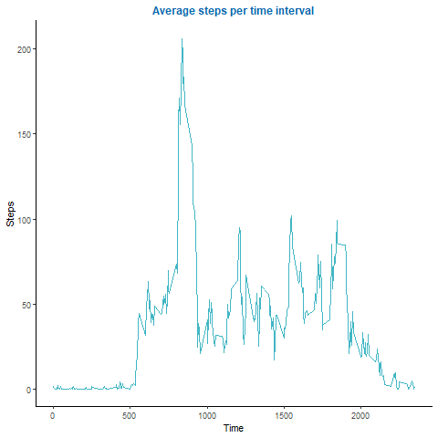
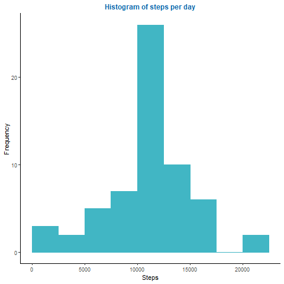

# Introduction

The following exercise corresponds to the first course project of the module **Reproducible Research** from *Coursera*. 

This assignment makes use of data from a personal activity monitoring device. This device collects data at 5 minute intervals through out the day. The data consists of two months of data from an anonymous individual collected during the months of October and November, 2012 and include the number of steps taken in 5 minute intervals each day.

## Load libraries and data

Data used in this document can be downloaded from this [link](https://d396qusza40orc.cloudfront.net/repdata%2Fdata%2Factivity.zip)

The variables included in this dataset are:

- **steps:** Number of steps taking in a 5-minute interval (missing values are coded as \color{red}{\verb|NA|}NA)
- **date:** The date on which the measurement was taken in YYYY-MM-DD format
- **interval:** Identifier for the 5-minute interval in which measurement was taken
```{r data}
library(ggplot2)
# read file
activity.data <- read.csv("Data/activity.csv")
# show the variables
head(activity.data)
```

# What is mean total number of steps taken per day?
## Total number of steps

Calculate the total number of steps taken per day
```{r steps_day}
## Sum the total number of steps per day
activity.data.2 <- aggregate(activity.data$steps, list(activity.data$date), FUN = sum, na.rm = TRUE)
## Change the name of the columns
names(activity.data.2) <- c("Date", "Steps")
## Display the first rows of the dataset
head(activity.data.2)
```

## Histogram of the total number of steps per day

Make a histogram of the total number of steps taken each day

```{r plot1}
## plot the histogram 
ggplot(data = activity.data.2, aes(Steps))+
  geom_histogram(boundary = 0,binwidth=2500, col="#41b6c4", fill="#41b6c4")+
  ylab("Frequency")+
  xlab("Steps")+
  ggtitle("Histogram of steps per day")+
  theme_classic()+
  theme(plot.title = element_text(face = "bold", color = "#0868ac", size = 12, hjust = 0.5))
```
 
## Mean and median of the total number of steps per day

Calculate and report the mean and median of the total number of steps taken per day
```{r median}
# calculate the mean
mean.steps <- mean(activity.data.2$Steps, na.rm = TRUE)
# calculate the median
median.steps <- median(activity.data.2$Steps, na.rm = TRUE)
```

The mean of the total number of steps per day is **`r mean.steps`**.

The median of the total number of steps per day is **`r median.steps`**.

# What is the average daily activity pattern?
## Average of activity pattern for each day

Make a time series plot (i.e. **type** = "l") of the 5-minute interval (x-axis) and the average number of steps taken, averaged across all days (y-axis)
```{r plot2}
## calculate the mean of steps by intervals
activity.data.3 <- aggregate(steps~interval, activity.data, FUN = mean, na.rm = TRUE)
## plot the mean
ggplot(activity.data.3, aes(interval, steps))+
  geom_line(col="#41b6c4", size = 0.70)+
  ggtitle("Average steps per time interval")+
  xlab("Time")+
  ylab("Steps")+
  theme_classic()+
  theme(plot.title = element_text(face = "bold", color = "#0868ac", size = 12, hjust = 0.5))
```
 
## Interval with the maximum number of steps 

Which 5-minute interval, on average across all the days in the dataset, contains the maximum number of steps?

```{r max.values}
## search for the interval with the maximum number of steps 
max.interval <- activity.data.3[which.max(activity.data.3$steps),]$interval
max.steps <- activity.data.3[which.max(activity.data.3$steps),]$steps
```

The interval with the maximum number of steps is **`r max.interval`** with **`r max.steps`** of steps

# Imputing missing values

Note that there are a number of days/intervals where there are missing values (coded as **NA**). The presence of missing days may introduce bias into some calculations or summaries of the data.

## Total number of missing values

Calculate and report the total number of missing values in the dataset (i.e. the total number of rows wit **NAs**)

```{r missing.values}
## calculate the total number of NAs
missing.values <- sum(is.na(activity.data$steps))
```

The total number of missing values is `r missing.values`

## Replace missing values

Devise a strategy for filling in all of the missing values in the dataset. The strategy does not need to be sophisticated. For example, you could use the mean/median for that day, or the mean for that 5-minute interval, etc.

```{r replace.values}
## Replace the missing values
activity.data$Replace <- ifelse(is.na(activity.data$steps), round(activity.data.3$steps[match(activity.data$interval, activity.data.3$interval)],0), activity.data$steps)
```

## New dataset

Create a new dataset that is equal to the original dataset but with the missing data filled in.

```{r new.dataset}
## Create a new dataset
activity.data.4 <- data.frame(steps=activity.data$Replace, interval=activity.data$interval, date=activity.data$date)
```

## Histogram for the new dataset

Make a histogram of the total number of steps taken each day. 

```{r plot3}
## Sum the steps by day
activity.data.5 <- aggregate(activity.data.4$steps, list(activity.data.4$date), FUN = sum)
## Change the name of the columns
names(activity.data.5) <- c("Date", "Steps")
## plot the histogram
ggplot(activity.data.5, aes(Steps))+
  geom_histogram(boundary = 0, binwidth=2500, col="#41b6c4", fill="#41b6c4")+
  ylab("Frequency")+
  xlab("Steps")+
  ggtitle("Histogram of steps per day")+
  theme_classic()+
  theme(plot.title = element_text(face = "bold", color = "#0868ac", size = 12, hjust = 0.5))
```
 
Calculate and report the mean and median total number of steps taken per day. Do these values differ from the estimates from the first part of the assignment? What is the impact of imputing missing data on the estimates of the total daily number of steps?
```{r median.2}
mean.steps.2 <- mean(activity.data.5$Steps)
median.steps.2 <-median(activity.data.5$Steps)
```

The mean of the total number of steps per day in the new dataset is **`r mean.steps.2`** and in the original dataset was **`r mean.steps`**. 

For the median, in the new dataset we obtained **`r median.steps.2`** and in the median in the original dataset is equal to **`r median.steps`**


# Are there differences in activity patterns between weekdays and weekends?

For this part the **weekdays()** function may be of some help here. Use the dataset with the filled-in missing values for this part.

Create a new factor variable in the dataset with two levels – “weekday” and “weekend” indicating whether a given date is a weekday or weekend day.

```{r weekday}
# Correct format
activity.data.4$Date.2 <- as.Date(activity.data.4$date, format = "%Y-%m-%d")
# Create a new column for weekdays
activity.data.4$weekday <- weekdays(activity.data.4$Date.2)
# Create a new column to indicate if it's weekday or weekend
activity.data.4$Day.2 <- ifelse(activity.data.4$weekday=='Saturday' | activity.data.4$weekday=='Sunday', 'weekend','weekday')
# see first values of the dataset
head(activity.data.4)
```

## Average of steps per time interval in weekdays and weekends

Make a panel plot containing a time series plot (i.e. **type** = "l") of the 5-minute interval (x-axis) and the average number of steps taken, averaged across all weekday days or weekend days (y-axis).

```{r plot4}
# Sum the steps by interval and day type
activity.data.6 <- aggregate(steps~interval+Day.2, data=activity.data.4,FUN=mean,na.rm= TRUE)
# plot
ggplot(activity.data.6, aes(interval, steps))+
  geom_line(col="#41b6c4", size = 0.75)+
  ggtitle("Average of steps per time interval in weekdays and weekends")+
  xlab("Time")+
  ylab("Steps")+
  theme(plot.title = element_text(face = "bold", color = "#0868ac", size = 12, hjust = 0.5))+
  facet_grid(Day.2 ~.)
```
 
